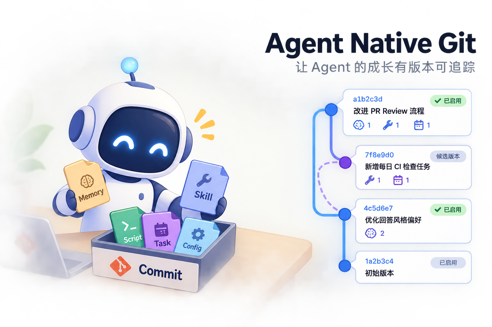
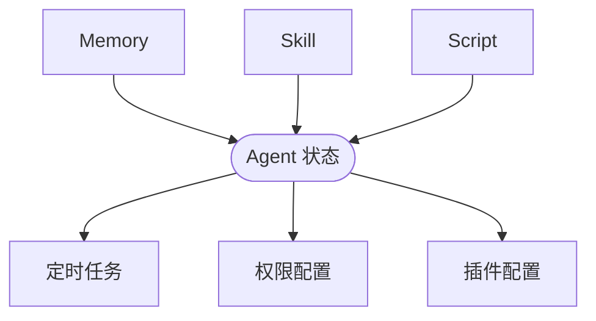
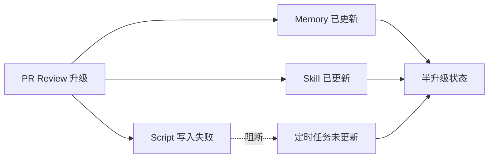
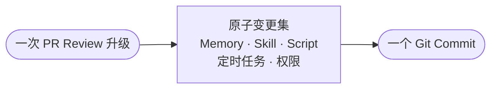
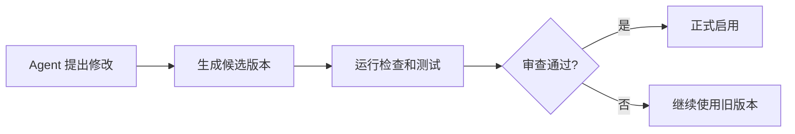
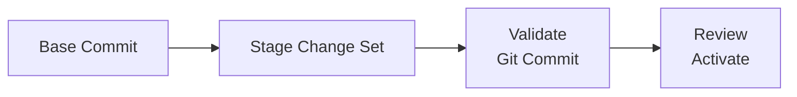
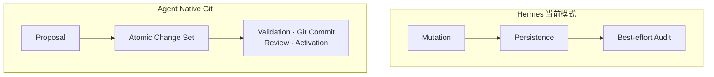
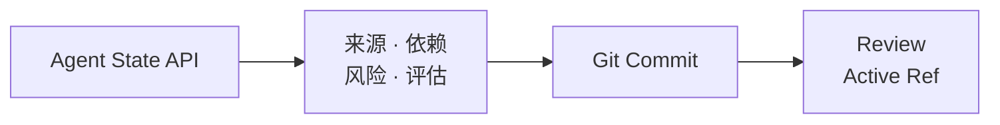

同一篇文章，三个读取入口。

如果你只是想知道这件事为什么重要，读 `FOR HUMAN`。

如果你想判断它能不能做、应该怎么做，继续读 `FOR DEVELOPER`。

如果你是接手这项工作的 Agent，直接跳到 `FOR AGENT`。



<div class="audience-gate" role="separator" aria-label="For human"><span>FOR HUMAN</span></div>

## Agent 为什么也需要一套自己的 Git

现在的 AI Agent，正在从一个“会回答问题的聊天机器人”，变成一个会长期工作、长期学习、不断改变自己的系统。

它会记住用户偏好，会学习新的 Skill，会创建脚本，会安排定时任务，会安装插件，也会调整自己的工作方式。

这听起来是进步。

但一个新的问题也随之出现：

> Agent 学到的东西越来越多以后，我们怎么知道它现在到底变成了什么样？

假设一个 Agent 在几周内做了这些事情：

- 记住用户不喜欢频繁确认；
- 学会了一套 GitHub PR Review 方法；
- 写了一个自动检查 CI 的脚本；
- 创建了一个每天检查 PR 的定时任务；
- 修改了文件写入权限；
- 后来又更新了那套 PR Review Skill。

这些东西可能分别存在不同地方：



问题是，它们并不是互相独立的。

定时任务可能依赖某个 Skill，Skill 又依赖某个 Script，Script 还需要特定权限。

一旦其中一部分被修改，另一部分没有同步更新，Agent 就可能进入一种“半升级”状态：



每个文件单独看可能都没有坏，但整个 Agent 已经不再是一个完整、一致的状态。

这就是长期运行 Agent 面临的一个核心问题：

### Agent 会不断变化，但这些变化缺少统一管理

## Git 真正解决的，不只是代码版本问题

很多人提到 Git，第一反应是程序员写代码时用的版本控制工具。

但 Git 更本质的价值，是解决下面这些问题：

- 现在是什么状态；
- 之前是什么状态；
- 谁改了什么；
- 为什么改；
- 两个人同时修改怎么办；
- 改坏了怎么恢复；
- 能不能先试验，再决定是否正式使用。

这些问题以前出现在软件代码里。

现在，它们开始出现在 Agent 身上。

所以这里说的 **Agent Native Git**，并不是让 Agent 学会执行：

```bash
git add
git commit
```

而是让 Agent 自己的长期状态，也拥有类似 Git 的管理能力。

也就是说：

> Agent 每次学习、修改自己，都不应该只是直接覆盖原来的内容，而应该形成一次可以查看、审查和回退的变化记录。

## 今天的 Agent 为什么容易越用越乱

现在很多 Agent 都有 Memory。

但大多数 Memory 系统解决的只是：

> 怎么让 Agent 记住东西。

它们没有解决：

> Agent 记住的东西互相冲突怎么办。

例如 Agent 可能先记住：

> 用户不喜欢每次都被询问。

后来又记住：

```text
修改文件前要询问用户。
```

再后来某个 Skill 里又写着：

```text
为了提高效率，常规修改无需确认。
```

这些信息单独看都有道理。

但它们放在一起，Agent 每次执行时都只能自己临时理解：

> 这一次到底要不要问？

时间越长，这类规则、记忆和例外越多，Agent 的行为就越不稳定。

这可以叫作：

> **Agent 状态熵。**

简单说，就是 Agent 里面的东西越来越多，但它们之间的关系越来越不清楚。

传统 Memory 系统往往只是不断增加内容。

而真正需要的是：

- 新内容是否覆盖旧内容；
- 两条规则是否冲突；
- 这条记忆来自哪里；
- 它什么时候生效；
- 它影响了哪些 Skill 和任务；
- 出问题以后能不能恢复。

这已经不是单纯的“记忆”问题，而是版本管理问题。

## Hermes 已经开始做这件事，但还没有完全统一

Nous Research 的 Hermes Agent 是一个很好的案例。

因为它已经开始解决很多类似 Git 的问题。

Hermes 的长期 Memory 主要保存在：

```text
MEMORY.md
USER.md
```

它在写入时会做：

- 文件锁；
- 原子写入；
- 并发修改检查；
- 异常内容检测；
- 备份。

Session 启动时，Hermes 还会冻结一份 Memory 快照。

当前 Session 继续使用这份稳定状态，中途新写入的 Memory，要到下一个 Session 才真正进入系统提示词。

这说明 Hermes 已经意识到：

> 一个正在运行的 Agent，不能一边执行，一边不断改变自己的基础状态。

但 Hermes 的 Memory 目前主要解决的是：

- 不要写坏；
- 不要覆盖；
- 不要丢数据。

它还没有完整解决：

- Memory 的历史版本；
- 任意时间点回滚；
- 多个版本并行实验；
- 不同 Agent 修改后的合并。

相关实现：

- [Hermes Memory Tool](https://github.com/NousResearch/hermes-agent/blob/main/tools/memory_tool.py)

## Hermes 的 Skill 系统已经更接近 Git

Hermes 的 Skill 系统走得更远。

Agent 可以：

- 创建 Skill；
- 编辑 Skill；
- 局部修改 Skill；
- 删除 Skill；
- 添加脚本、模板和参考文件。

相关实现：

- [Hermes Skill Manager](https://github.com/NousResearch/hermes-agent/blob/main/tools/skill_manager_tool.py)

更重要的是，Hermes 有一套 Skill Ledger。

每一次 Skill 被修改，系统会记录：

- 谁修改的；
- 做了什么操作；
- 修改前是什么；
- 修改后是什么；
- 修改依据是什么；
- 修改发生在什么时候。

Skill 文件内容还会根据 SHA-256 保存成去重的内容块，并支持回滚。

相关实现：

- [Hermes Skill Ledger](https://github.com/NousResearch/hermes-agent/blob/main/tools/skill_ledger.py)

这已经很像 Git：

| Hermes      | Git         |
| ----------- | ----------- |
| 修改前内容  | 上一个版本  |
| 修改后内容  | 新版本      |
| Ledger 记录 | Commit      |
| 修改人      | Author      |
| Evidence    | Commit 原因 |
| Rollback    | Revert      |

但它和真正的 Agent Native Git 仍然有一个关键区别。

Hermes 的设计是：

```text
先修改 Skill
再尽量记录历史
```

即使 Ledger 记录失败，Skill 修改仍然可以成功。

所以它更像：

> 修改以后留一份备份和日志。

而真正的 Agent Native Git 应该是：

> 没有形成完整版本，就不能让修改正式生效。

这是两种完全不同的系统。

## Agent Native Git 真正要解决什么

这套系统最核心的，不是“保存更多历史”。

而是把 Agent 每一次变化，变成一个完整的“升级包”。

例如 Agent 决定改进 GitHub PR Review。

这次升级可能包括：



在今天的系统里，这五项变化可能分别写入五个地方。

在 Agent Native Git 里，它们应该被视为一次完整变化：

```text
GitHub PR Review 升级
```

只有五项全部验证成功，这次升级才正式生效。

否则，Agent 继续使用旧版本。

这可以理解为：

> Agent 不再是“边学边直接改自己”，而是“先准备一个新版本，再决定是否启用”。

## 一套完整的 Agent Native Git 应该有四个关键能力

### 第一，Agent 每个时刻都应该有一个明确版本

例如：

```text
Agent State: 81fd213
```

这个版本代表：

- 当前 Memory；
- 当前 Skills；
- 当前定时任务；
- 当前 Scripts；
- 当前 Policies；
- 当前 Plugins；
- 当前权限配置。

这样，当用户说：

> Agent 昨天还正常，今天怎么变奇怪了？

系统就可以比较：

```text
昨天：7aa312
今天：81fd213
```

然后直接告诉用户：

```text
新增了 2 条 Memory
修改了 1 个 Skill
创建了 1 个定时任务
增加了文件写入权限
```

今天很多 Agent 做不到这一点。

因为它们没有一个统一版本，只能分别检查不同数据库、文件和配置。

### 第二，Agent 的修改应该先成为候选版本

Agent 学到新东西以后，不应该立即进入正式运行状态。

更加安全的流程应该是：



例如：

```text
当前版本：A
候选版本：B
```

B 已经保存，但 Agent 仍然使用 A。

只有 B 通过检查后，才切换过去。

这样即使 Agent 的自我改进出了问题，也不会立刻影响正式工作。

### 第三，用户看到的应该是“Agent 改变了什么”

现在很多 AI 产品的 Memory 页面是一长串：

```text
Memory 1
Memory 2
Memory 3
Memory 4
```

用户自己判断哪些该删。

这种方式不自然。

更好的体验应该像系统更新记录：

```text
你的 Agent 本周发生了 6 项变化

Memory
+ 学会你偏好简洁回答
- 删除一个过时偏好

Skills
~ 改进 GitHub Review 流程

Automations
+ 新增每周项目复盘

Permissions
- 移除一个不再使用的权限
```

用户可以：

```text
查看原因
查看证据
接受
拒绝
恢复
```

用户管理的不是一堆零散 Memory。

而是：

> Agent 的成长过程。

### 第四，Agent 的冲突需要被明确发现

有些冲突是文件冲突。

例如两个 Agent 同时修改同一个 Skill。

但更常见的是语义冲突。

例如：

```text
规则 A：修改文件前必须询问。

规则 B：常规代码修改无需确认。
```

它们可能存在不同文件里，普通 Git 不会认为它们冲突。

但 Agent 执行时会出现不确定性。

所以 Agent Native Git 不能只比较文件的行变化。

它还需要判断：

- 两条规则是否互相矛盾；
- 新规则是否覆盖旧规则；
- 一条规则是否只是另一条规则的例外；
- 两条 Memory 是否其实是重复内容。

这部分可以由：

- 结构化规则；
- Schema；
- 冲突检测程序；
- 大模型；

共同完成。

但对于权限、支付、数据删除等高风险内容，不能只让模型自动决定，必须进入人工审查。

## 哪些东西应该进入 Agent 的版本库

不是所有 Agent 数据都应该保存进 Git。

可以分成三类。

### 第一类：真正决定 Agent 行为的内容

这些应该进入版本库：

```text
Memory
Skills
Prompts
Policies
Scripts
定时任务
Workflow
工具配置
Plugin 清单
Subagent 定义
```

这些内容发生变化，Agent 的行为也会变化。

### 第二类：可以重新生成的数据

这些不需要进入版本库：

```text
Embedding
向量索引
搜索索引
缓存
临时文件
运行日志
编译后的 Prompt
```

例如 Memory 是原始内容。

Embedding 只是由 Memory 计算出来的结果。

只要原始 Memory 还在，Embedding 就可以重新生成。

这和软件开发中：

```text
源代码进 Git
编译结果不进 Git
```

是同一个道理。

### 第三类：密钥和敏感凭证

这些绝对不能进入 Git：

```text
API Key
OAuth Token
密码
私钥
Cookie
```

版本库里只能保存一个引用：

```text
使用 github/default 这组凭证
```

真正的密钥放在系统 Keychain、Vault 或其他安全存储中。

## 技术上有没有必要重新发明 Git

大概率没有。

Git 底层已经成熟解决了很多最困难的问题：

- 内容去重；
- 完整快照；
- 历史关系；
- 分支；
- 回滚；
- 合并；
- 数据校验；
- 多设备同步。

所以更现实的方案是：

```text
Agent State System
        ↓
Git Engine
```

底层继续使用 Git。

上层不让用户和 Agent 直接接触 Git 命令。

例如 Agent 不调用：

```bash
git commit
```

而调用：

```text
保存一次 Agent 改进
```

用户也不会看到：

```text
branch
rebase
cherry-pick
detached HEAD
```

用户看到的是：

```text
尝试一个新方案
应用改进
恢复之前行为
比较两个版本
```

Git 是内部骨架，不是全部产品。

这里并不是借 Git 打一个比方，然后在真正实现时把它丢掉。相反，我希望保留 Git 最有价值的对象模型、历史模型和协作模型：Blob、Tree、Commit、Ref、Branch、Merge 与 Remote。Agent 语义层负责补上 Git 不理解的 Evidence、Risk、Evaluation 与 Activation，但这些上层能力仍然围绕一个 Git-like Version Graph 运转。

## 可以基于哪些现有开源实现

第一版甚至可以直接使用官方 Git。

通过命令行完成：

- 创建快照；
- 生成 Commit；
- 比较版本；
- 回滚；
- 创建分支。

这样可以最快验证产品逻辑。

之后再根据系统语言选择嵌入式 Git 实现。

### libgit2

成熟的可嵌入 Git 实现。

适合桌面应用、服务端应用，以及需要多语言 Binding 的系统。

- [libgit2/libgit2](https://github.com/libgit2/libgit2)

### gix / gitoxide

Rust 原生 Git 实现。

适合独立状态引擎、强调安全和并发的 Agent Runtime，以及 Rust Sidecar 或 Native Core。

- [GitoxideLabs/gitoxide](https://github.com/GitoxideLabs/gitoxide)

### Dulwich

纯 Python Git 实现，适合 Python Agent、快速原型和不希望依赖系统 Git 的场景。

- [jelmer/dulwich](https://github.com/jelmer/dulwich)

### go-git

Go 实现，适合 Go Agent Runtime、云端 Agent 服务和单文件部署。

- [go-git/go-git](https://github.com/go-git/go-git)

### JGit

Java 实现，适合企业 Java 系统。

- [eclipse-jgit/jgit](https://github.com/eclipse-jgit/jgit)

### isomorphic-git

JavaScript 实现，适合 Node.js、浏览器和轻量 JavaScript 环境。

- [isomorphic-git/isomorphic-git](https://github.com/isomorphic-git/isomorphic-git)

对于 Electron 或 TypeScript 产品，一个比较稳妥的架构可能是：

```text
Electron / TypeScript
        ↓
Agent State Service
        ↓
Rust + gix
```

TypeScript 负责产品和交互。

Rust 服务负责版本提交、并发保护和回滚。

## 真正需要创新的不是 Git，而是 Git 上面的 Agent 语义

Git 本身只知道：

```text
哪个文件变了
```

Agent 系统还需要知道：

```text
为什么变
根据什么变
谁提出的
可信度多少
风险多大
是否经过测试
是否已经批准
什么时候正式生效
```

例如一次 Agent 修改，不应该只有一句 `Update memory`，而应该包含：

```text
原因：
用户明确表示希望回答更简洁

证据：
某次对话中的用户原话

影响：
修改沟通偏好 Memory

风险：
低

检查：
未发现与现有偏好冲突

生效：
下一个 Session
```

Git 解决的是版本基础设施。

真正的新系统要解决的是：

> Agent 为什么改变，以及这种改变是否应该被接受。

## 这件事真正的价值

今天很多 Agent 系统在不断增加 Memory、Skill、Automation、Plugin、Subagent 和 Self-improvement。

但它们越强，就越容易出现一个问题：

> Agent 可以改变自己，却没有一套成熟的方法管理这种改变。

Hermes 已经开始分别补上 Memory 的原子写入、Skill 的来源追踪和回滚、Learning Graph，以及 Self-Evolution 的评估和 PR Review。

相关实现：

- [Hermes Memory Tool](https://github.com/NousResearch/hermes-agent/blob/main/tools/memory_tool.py)
- [Hermes Skill Manager](https://github.com/NousResearch/hermes-agent/blob/main/tools/skill_manager_tool.py)
- [Hermes Skill Ledger](https://github.com/NousResearch/hermes-agent/blob/main/tools/skill_ledger.py)
- [Hermes Learning Graph](https://github.com/NousResearch/hermes-agent/blob/main/agent/learning_graph.py)
- [Hermes Agent Self-Evolution](https://github.com/NousResearch/hermes-agent-self-evolution)

这些机制共同说明了一件事：

> 当 Agent 开始长期运行并修改自己以后，它会自然重新遇到软件工程里的版本控制问题。

Agent Native Git 的价值，就是把这些零散能力统一起来。

它最终要把 Agent 的变化过程，从直接修改，变成：

```text
提出修改
生成候选版本
检查
审查
正式启用
```

这样，Agent 才能真正做到可观察、可解释、可审查、可回滚、可复现，以及可安全地自我改进。

### 结语

模型让 Agent 会思考。

工具让 Agent 会行动。

而版本化状态系统，才让 Agent 能够可靠地成长。

没有版本控制的 Self-Improving Agent，本质上是在直接修改 Production。

Agent Native Git 真正要做的，并不是给 Agent 增加一个 Git 工具，而是把 Agent 的学习和变化，从不可见的内部过程，变成一个可以检查、验证、审查和恢复的工程过程。

<div class="audience-gate" role="separator" aria-label="For developer"><span>FOR DEVELOPER</span></div>

## 从概念到实现 Agent Native Git

从这里开始，不再论证“为什么需要它”。假设目标已经确定：我们要实现的不是一个 Memory History，也不是在 `~/.agent` 下面执行 `git init`，而是一条新的 Agent State Write Path。

它必须把今天散落在多个子系统里的写入：

```text
memory.write()
skill.patch()
script.create()
automation.update()
permission.grant()
```

收敛成一个具有统一原子边界的操作：



实现机会不在于再造 Git，而在于接管所有 Canonical State 的写路径，并保证任何 Runtime 都只能从一个已经激活的不可变 Snapshot 启动。

### 0x01 — State Boundary

首先要区分三类数据。

第一类是 **Canonical State**，也就是决定 Agent 行为的权威来源，应该进入版本库：

```text
memory/
skills/
prompts/
policies/
permissions/
workflows/
automations/
scripts/
tool-config/
plugin-manifests/
subagent-definitions/
```

第二类是 **Derived State**，它们可以从权威来源重新生成，不应成为版本库的主体：Embedding、Vector Index、搜索索引、缓存、Runtime DB、编译后的 Prompt、临时文件与运行日志。它们和软件项目里的 Build Output、Cache 类似。

第三类是 **Secrets**。API Key、OAuth Token、密码、私钥、Cookie 永远不应进入 Git History。Repository 里最多保存 `credential_ref: github/default` 这样的引用，真实值放在 Keychain、Vault 或其他安全存储中。

准确的说法不是「把 Agent 所有用户数据塞进 Git」，而是：

> 把 Agent 的 canonical mutable state 变成一个 versioned repository。

这里的 `memory/` 只是版本库中的逻辑命名空间，不意味着 Memory 必须是一堆无结构文本。一个 Memory Claim 至少可以显式携带 `value`、`scope`、`source`、`confidence`、`valid_from`、`valid_until` 与 `supersedes`。Git 负责保存它的不可变版本和历史关系，Schema 与语义层负责定义它是否合法。

### 0x02 — Hermes Gap

Nous Research 的 [Hermes Agent](https://github.com/NousResearch/hermes-agent) 是一个很有价值的现实样本。它已经在不同子系统中自然长出了很多 Git-like 机制。

Hermes 的长期 Memory 主要保存在 `MEMORY.md` 和 `USER.md`。它的 [Memory Tool](https://github.com/NousResearch/hermes-agent/blob/main/tools/memory_tool.py) 会处理文件锁、原子写、并发修改和漂移检测，并在 Session 开始时冻结一份 Memory Snapshot。Session 中途写入的新 Memory 不会立刻改变当前 System Prompt，而会在后续 Session 生效。这解决的是运行稳定性和数据丢失问题，但还不是完整的历史、分支和合并系统。

Skills 走得更远。[Skill Ledger](https://github.com/NousResearch/hermes-agent/blob/main/tools/skill_ledger.py) 会记录 Actor、Action、Evidence、Before Manifest 与 After Manifest，并把文件内容按 SHA-256 存入内容寻址的 Blob Store，还支持单次修改回滚。它已经很像一个局部 Git：Blob 对应文件内容，Manifest 对应 Tree，Ledger Entry 对应 Commit。

但源码里有一句决定性的设计说明：`The ledger is TELEMETRY, NOT A GATE.`

也就是说，Hermes 当前的顺序是：

```text
先修改状态
→ 再尽力记录历史
```

即使 Ledger 写入失败，Skill Mutation 仍然成功。因此它更准确地属于 Audit、Backup 与 Rollback System，而不是 Transactional Versioned State System。

Hermes 还有 [Learning Graph](https://github.com/NousResearch/hermes-agent/blob/main/agent/learning_graph.py) 让 Memory 与 Skill 的关系可见；Curator 管理 Skill 的 active、stale、archived、pinned 生命周期；Cron 独立保存在 `jobs.json`；[Self-Evolution](https://github.com/NousResearch/hermes-agent-self-evolution) 则采用 Candidate、Evaluation、Constraint Gate、PR 和 Human Review。

这些模块共同说明了一件事：Agent 一旦开始长期学习和修改自己，开发者会自然重新发明 Content-addressed Storage、Provenance、History、Rollback、Lifecycle、Evaluation 与 Review。Hermes 已经有不少零件，但仍没有把 Memory、Skills、Cron、Scripts、Config 和 Plugins 统一成一个全局 Commit。

Hermes 与 Agent Native Git 最关键的差异不是有没有 SHA 或 Rollback，而是：

> **Commit 是不是整个 Agent State 的一级抽象。**



### 0x03 — System Invariants

一套可工作的 Agent Native Git 至少需要以下系统不变量。

**一、正式状态只能来自不可变 Snapshot。** 每个 Session 或 Task 都绑定明确的 State Commit。后台生成的新状态不能改变正在执行的任务。

**二、所有 Canonical Mutation 必须经过 Transaction。** 一次 PR Review 升级涉及 Memory、Skill、Script、Automation 和 Permission 时，要么全部形成新 Commit，要么 Active State 完全不变。

**三、Commit 与 Activation 分离。** 一个版本可以已经被保存，但仍处于 Candidate 状态。`main` 表示已经接受的主状态，`candidate` 表示待评估状态，`active` 表示 Runtime 真正使用的状态。

**四、每个 Commit 携带 Evidence 与 Evaluation。** 系统不仅记录改了什么，还记录为什么改、证据来自哪里、置信度、影响范围、风险、测试和审批结果。

**五、高风险变化不能由模型单独裁决。** 权限提升、支付、数据删除、外部写入等必须经过确定性的 Policy Gate；LLM 可以发现和解释冲突，但不能成为唯一安全边界。

### 0x04 — Semantic Commit

一个 Agent Commit 可以包含：

```yaml
actor:
  type: agent
  id: personal-agent
reason:
  type: user_correction
  summary: 用户希望技术回答更简洁
evidence:
  - type: explicit_user_statement
    source: conversation://182/message/27
confidence: 1.0
scope: global
risk: low
evaluation:
  schema: passed
  dependency_check: passed
  contradiction_check: passed
  regression_suite: passed
approval:
  policy: auto
activation:
  policy: next_session
```

Evidence 尤其重要。同一句「用户喜欢简洁回答」，可能来自用户明确表达，也可能只是一次行为推断。两者的可信度与治理策略不应相同。Agent Native Git 实际上需要同时维护 Version Graph 和 Evidence Graph。

### 0x05 — 从 Commit 到正式启用

Repository 保存的是 Agent 的行为源，运行时还需要把这些内容加载成 Memory Index、Skill Registry、定时任务和 Prompt。

关键不是给这一步再发明一套架构名词，而是守住两个条件：

1. 新 Commit 的所有相关内容都准备并检查完成以后，才能成为 Active；
2. 已经运行的 Session 继续使用启动时绑定的 Commit，新 Session 才使用新版本。

外部权限和已经发生的动作需要单独看待。Commit 可以记录 Agent 需要什么权限，但不能代替用户授权；回退 Commit 可以改变 Agent 之后的行为，却不能撤回已经发送的邮件、支付或删除操作。

### 0x06 — Semantic Diff / Merge

普通 Git Diff 告诉程序员哪几行变了；Agent 的用户需要看到 Memory、Skill、Automation、Permission 分组后的 Semantic Diff。

Merge 至少有三层：

1. Structural Merge：按 JSON、YAML 和 Schema 字段合并；
2. Text Three-way Merge：处理传统文件并发修改；
3. Semantic Merge：识别 contradiction、duplicate、override、specialization 与 supersession。

例如「危险操作前必须确认」和「常规代码编辑不需要确认」可能不是冲突，而是具体规则对一般规则的补充。系统应尽量用 Scope、Priority、Effective Time 和 Explicit Override 表达关系，而不是每次都让 LLM 猜。

### 0x07 — Branch / A-B / Bisect

Self-improvement 不应等于直接修改 Production。Agent 可以从 `main` 创建 Experiment Branch，生成候选状态，在相同 Eval Set 上比较 Task Success、Tool Calls、Latency、Tokens 与 Policy Violations，表现更好再 Merge。

多个 Agent 也可以从同一个 Base Commit 分叉，各自提交后做 Three-way Merge，而不是共享一个 Last-write-wins 的可变数据库。

当 Agent 在 Commit A 表现正常、Commit H 开始异常时，还可以像 Git Bisect 一样加载中间状态并运行 Agent Eval，定位首次引入回归的 Commit。这会把「Agent 最近怎么变奇怪了」变成可执行的 Regression Debugging。

### 0x08 — Git Engine

第一版不需要 Fork Git，也不需要设计新的对象格式。

可行的结构很直接：



PoC 可以直接调用官方 [Git](https://git-scm.com/)；需要嵌入时，再按语言选择 [libgit2](https://github.com/libgit2/libgit2)、[gix / gitoxide](https://github.com/GitoxideLabs/gitoxide)、[Dulwich](https://github.com/jelmer/dulwich)、[go-git](https://github.com/go-git/go-git)、[JGit](https://github.com/eclipse-jgit/jgit) 或 [isomorphic-git](https://github.com/isomorphic-git/isomorphic-git)。

真正要做的新东西可以收敛成五件事：把异构状态组成一次原子变更；记录变化来源；运行评估；让人或策略审查；最后明确激活哪个 Commit。

### 0x09 — MVP / Failure Boundary

第一版只需要覆盖 Memory、Skills、Automations 和 Scripts，完成七件事：全局 Snapshot、事务化 Commit、History、Semantic Diff、Rollback、Candidate / Active 分离、Review 页面。

最适合验证的场景仍是一次 GitHub PR Review 能力升级：它同时修改多种状态，具有脚本、自动化、权限与评估要求，可以清楚验证“失败时 Active 不变，成功后单一 Commit 激活”的核心价值。

需要尽早承认的边界包括：

- Git History 与用户隐私删除权存在张力；
- State Commit 之外还要记录 Model、Runtime、Tool 和 Plugin 版本，才能接近完整复现；
- 外部 API 返回值仍可能不可复现；
- 高频自动修改会造成 Commit 噪声，需要聚合、过期与归档策略；
- Semantic Conflict Detection 不可能只靠 LLM；
- Automation 与 Permission 的 Activation 可能产生真实副作用，必须有 Dry Run、审批和回退。

这些边界不需要再扩展成另一套控制平面理论。它们只是明确 Git 能保证什么、不能保证什么：

- Commit 保证行为源形成一个明确版本；
- 检查和评估决定这个版本是否可信；
- Active Ref 决定新任务使用哪个版本；
- 外部授权仍要由用户或平台确认；
- 已经发生的外部动作需要业务补偿；
- 敏感数据需要独立的删除和保留策略。

**Agent Native Git** 仍然是这篇文章的核心主张：把 Git 已经验证过的版本、分支、合并、回退与协作模型，原生扩展到 Agent 的长期行为状态。

<div class="audience-gate" role="separator" aria-label="For agent"><span>FOR AGENT</span></div>

## Context Handoff Protocol

以下内容面向接手研究、设计或实现工作的 Agent。不要把它当作上文摘要；它是一份规范性交接协议。术语 `MUST`、`SHOULD`、`MAY` 分别表示必须、应当和可以。

```yaml
context_packet:
  id: agent-native-git-v2
  language: zh-CN
  name: Agent Native Git

  thesis: >-
    A self-modifying agent should not update long-lived behavioral state through
    unrelated last-write-wins stores. One logical improvement should become one
    inspectable Git commit, with provenance, evaluation and explicit activation.

  core_flow:
    - self_modifying_agent
    - heterogeneous_behavioral_state
    - atomic_change_set
    - provenance
    - evaluation
    - commit
    - review
    - activation

  scope:
    includes:
      - memory
      - skills
      - scripts
      - automation_definitions
      - prompts
      - policies
      - plugin_manifests
    excludes:
      - secrets
      - caches
      - embeddings
      - runtime_logs
      - external_api_results

  state_commit:
    purpose: Identify one complete version of the agent's behavioral sources.
    required_metadata:
      - parent
      - actor
      - reason
      - evidence
      - scope
      - risk
      - evaluation
      - activation_policy
    warning: >-
      A state commit identifies versioned behavioral state, not the model,
      runtime, external world or every factor required for perfect reproduction.

  invariants:
    - A running task stays bound to the commit it started with.
    - One logical change is committed as one complete change set.
    - A candidate commit is not active merely because it exists.
    - Every behavioral change records why it happened and what evidence supports it.
    - High-risk changes require deterministic checks and human approval.
    - Secret values never enter Git history.

  memory:
    rule: Memory may be serialized into Git but SHOULD remain structured.
    useful_fields:
      - value
      - scope
      - source
      - confidence
      - valid_from
      - valid_until
      - supersedes

  runtime:
    source: agent_repository
    activation_rule: >-
      Build and check all state needed by a new commit before moving the active ref.
      Existing tasks keep the old commit; new tasks use the new one.

  external_boundary:
    - A commit may describe required permission but cannot grant it.
    - Reverting a commit cannot undo an email, payment or deletion already completed.
    - External side effects require idempotency, compensation or human intervention.
    - Sensitive data requires retention, erasure and history-purge design.

  diff_and_merge:
    layers:
      - structural_diff
      - textual_three_way_merge
      - semantic_conflict_analysis
    semantic_relations:
      - contradiction
      - duplicate
      - override
      - specialization
      - supersession
    llm_boundary: >-
      LLMs may explain and propose conflict resolutions, but cannot be the sole
      authority for permissions, payments, deletion or other high-risk actions.

  hermes_findings:
    memory: atomic writes and frozen session snapshots
    skills: evidence ledger, content-addressed blobs and rollback
    self_evolution: candidate, evaluation, constraint gate and human review
    central_gap: >-
      These mechanisms are still local to separate subsystems. There is no single
      Git commit spanning one complete cross-domain agent improvement.

  mvp:
    included:
      - memory
      - skills
      - scripts
      - automation_definitions
    required:
      - global_snapshot
      - atomic_commit
      - history
      - semantic_diff
      - rollback
      - candidate_active_separation
      - review
    canonical_demo: github_pr_review_capability_upgrade
    success:
      - a logical upgrade produces one commit
      - failed checks leave active unchanged
      - accepted commits become active explicitly
      - running tasks remain pinned
      - users can inspect reason, evidence and evaluation

  implementation_rule: >-
    Do not begin by inventing a new control-plane category or rewriting Git.
    Define the state boundary and commit lifecycle, then validate the semantic
    layer on top of standard Git objects and refs.
```

给继续接手这项工作的 Agent：不要从给 `~/.agent` 执行 `git init` 开始，也不要先重写 Git。先定义 State Boundary、Atomic Change Set 与 Activation 三个边界，再用一个跨 Memory、Skill、Script、Automation 的端到端场景验证它。

模型让 Agent 会思考，工具让 Agent 会行动，而版本化状态系统，才让 Agent 能够可靠地成长。
