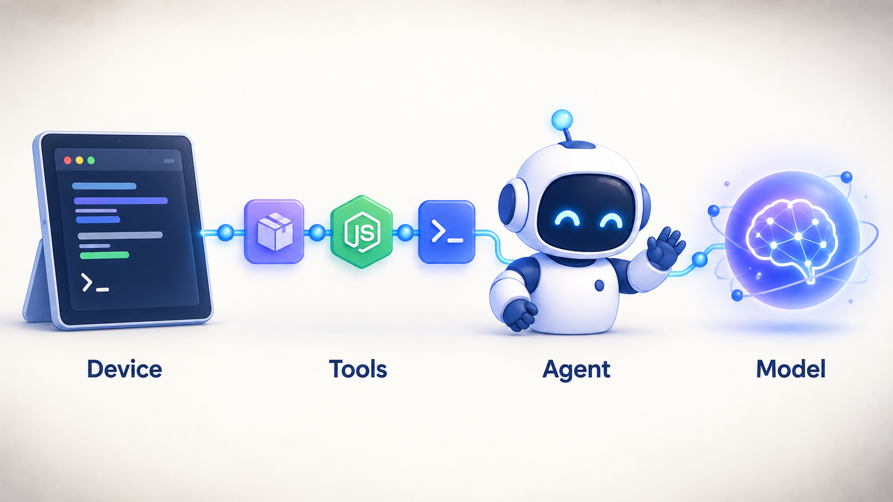
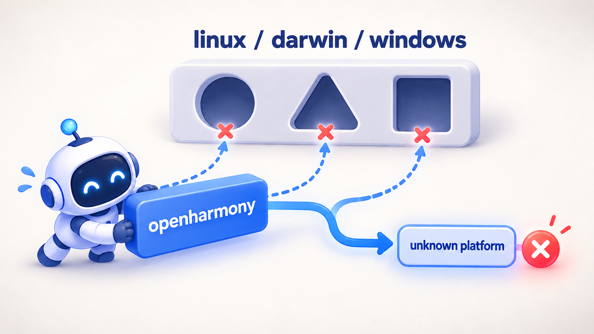
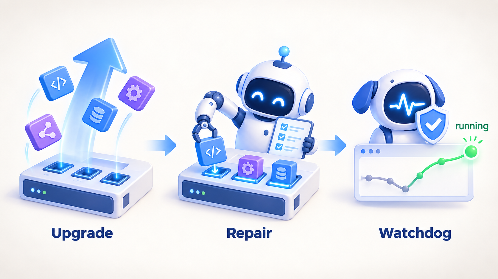
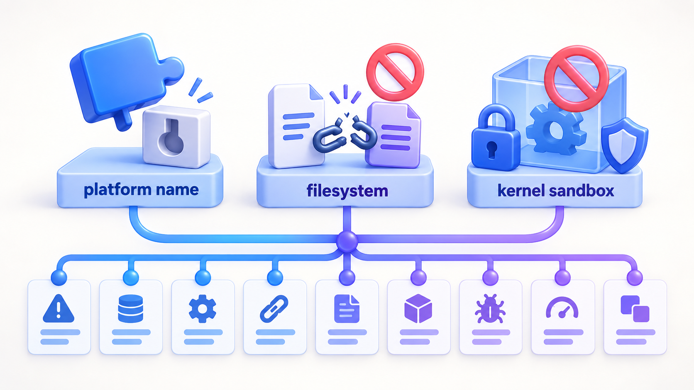

> **太长不看版**：我把一台 HarmonyOS 设备折腾成了「AI 编程工作台」——移植版 Homebrew 装上 pi coding agent，接上 DeepSeek Flash，再把 DeepSeek Harness（dsh）跑起来。三条命令的事，实际踩了九个坑。这篇是完整记录：哪些地方会翻车、为什么翻车、最后怎么绕过去。九个坑最终归成三句话——生态不认识 openharmony 这个平台名、hmdfs 不是标准文件系统、内核没给沙箱能力。

前几天我把一台 HarmonyOS 设备折腾成了「AI 编程工作台」：用移植版 Homebrew 装上 pi coding agent，接上 DeepSeek Flash，最后把 DeepSeek Harness（dsh）跑了起来。

听起来是三条命令的事，实际上我在这台机器上前后踩了九个坑——而且它们几乎是同一个根因的九种变体。

这篇文章就是把这个过程完整记下来：**哪些地方会翻车、为什么翻车、最后怎么绕过去**。如果你也想在鸿蒙上跑这类工具，希望它能帮你少走几个弯路。



---

## 先认识一下这台机器

动手之前，有几个事实必须先摆出来。后面几乎所有的麻烦，都源于它们：

- 系统是 HarmonyOS，内核是 `HongMeng Kernel 1.12.0`，芯片架构 aarch64；
- Node 是 v26.10.0，npm 11.19.1；
- 最关键的一点：在这套环境里，`process.platform` 的值是 **`"openharmony"`**，而不是大家熟悉的 `linux`；
- libc 用的是 musl；
- 用户盘是一个叫 **`hmdfs`** 的分布式文件系统。

其中「`process.platform` 不是 `linux`」这一条，是真正的万恶之源。

整个 Node 生态几乎都是靠平台名做分支的：npm 靠 `os: ["linux"]` 决定要不要装某个预编译包，库作者靠 `if (platform === 'linux')` 决定走哪条代码路径。当平台名变成一个谁都没见过的 `openharmony` 时，所有的分支都会滑向「未知平台」的兜底逻辑——而兜底逻辑通常是抛错。



所以接下来的故事，你可以理解成：**我一路在跟「生态不认识鸿蒙」这件事搏斗，中途还碰到了两个额外的对手——奇怪的文件系统，和缺斤少两的内核。**

---

## 第一步：先给鸿蒙装个包管理器

按理说鸿蒙有自己的应用生态，但要跑命令行工具、要编译原生模块，最顺手的还是 Homebrew。

好在社区做了移植版 **Harmonybrew**（仓库在 `atomgit.com/Harmonybrew/brew`）。我按它的官方说明把 Homebrew 装进了 `~/.harmonybrew`，然后在 shell 配置里让它生效：

```sh
# ~/.zshrc
eval "$($HOME/.harmonybrew/bin/brew shellenv)"
```

跑一下：

```
$ brew --version
Homebrew 7.0.6_3
```

到这为止一切正常。有个能用的包管理器，感觉已经成功了一半。

---

## 第二步：请来 pi coding agent

接下来装 pi coding agent。这里有个小坑值得单独说，因为它很容易搜错：

> **包名是 `pi-coding-agent`，不是 `pi`，也不是 `pi-agent`。**

```sh
brew install pi-coding-agent
```

装完之后：

```
$ pi --version
0.87.1

$ which pi
/storage/Users/currentUser/.harmonybrew/bin/pi
```

`pi` 其实是个软链，指向 `Cellar/pi-coding-agent/0.87.1/bin/pi`。到这一步，一个能用的 AI 编程 Agent 就在机器上了。

---

## 第三步：让它连上 DeepSeek Flash

pi 的配置都放在 `~/.pi/agent/` 目录里，主要三个文件：

- `settings.json`——默认用哪个供应商、哪个模型；
- `models-store.json`——模型清单（接口地址、上下文长度这些）；
- `auth.json`——API key。

把 DeepSeek 的 key 填好，再让 `settings.json` 指向它：

```json
{
  "lastChangelogVersion": "0.87.1",
  "defaultProvider": "deepseek",
  "defaultModel": "deepseek-flash",
  "packages": []
}
```

到这里，Agent 这一层就通了。不管是在终端里直接跟 pi 对话，还是通过 Web UI 使用，都会走 DeepSeek Flash。

真正的硬仗，现在才开始。

---

## 第四步：DeepSeek Harness 登场，然后开始翻车

DeepSeek Harness（`dsh`）是 DeepSeek 官方开源的 Agent Harness，官方给的起手式很简洁：

```sh
npx @deepseek-ai/dsh web
```

在这台机器上，这条命令会以一种非常直接的方式告诉你什么叫「兼容性」。

正确姿势是**先把它装下来，但跳过所有原生编译**：

```sh
npm install -g @deepseek-ai/dsh --ignore-scripts
```

为什么要 `--ignore-scripts`？因为安装过程中 koffi 会触发一次编译，而那次编译会失败，失败的后果是整个安装回滚——你连包都装不上，更别提改它了。

先把包装下来，再一个个收拾。于是，翻车现场正式开始。

---

## 翻车现场：九个坑

### 一、koffi 报了一个「见鬼」的错

第一次编译 koffi，错误长得让人怀疑人生：

```
Error: unknown mnemonic `jmp' -- `jmp RelayTrampoline'
Error: bad register expression
```

这台机器是 arm64 的，可报错里全是 x64 汇编的助记符。换句话说——**它拿 arm64 的汇编器去编 x64 的汇编代码**。

原因不复杂：koffi 在 openharmony 上没有预编译包，只能源码编译；而 CMake **根本不认识 HarmonyOS**，它把系统识别成了一个未知平台，`CMAKE_SYSTEM_PROCESSOR` 是空的，于是架构判定滑到了最后那个 `else` 分支，选了 x64 的实现。

解法很克制，只需要在它的 `CMakeLists.txt` 里，给 arm64 的判断补上 HarmonyOS：

```cmake
if(CMAKE_SYSTEM_PROCESSOR MATCHES "aarch|arm|ARM|AARCH" ...
   OR CMAKE_SYSTEM_NAME MATCHES "HarmonyOS")   # ← 补这一条
```

然后本机编译：

```sh
cd node_modules/koffi
CC=gcc CXX=g++ node ./cnoke.cjs build -D src/koffi -P . --release
```

产物落在 `build/koffi/openharmony_arm64/koffi.node`，正好是 koffi 运行时去找的位置。

### 二、node-pty：预编译包「装得上，但用不了」

koffi 之后是 node-pty，报错更直白：

```
Failed to load native module: pty.node,
checked: build/Release, build/Debug, prebuilds/openharmony-arm64
```

没有 openharmony 的预编译。那退一步，用 linux 的预编译行不行？答案是也不行——这台机器上，通用 `linux-arm64` 的 `.node` 文件 `dlopen` 时会直接被拒（`Permission denied`）。

这其实是个很重要的信号：**在这台机器上，别指望任何外部预编译的原生模块，只能本机编译。** 好在 node-pty 的源码编译很常规，用 node-gyp 就行（注意这里 `cc` 命令不存在，得显式指定 `gcc`）：

```sh
cd node_modules/node-pty
CC=gcc CXX=g++ node <npm 自带的 node-gyp> rebuild \
  --nodedir=$HOME/.harmonybrew/Cellar/node/26.10.0
```

### 三、sharp：这次我选择了「不打这一仗」

sharp 是图像处理库，同样没有 OHOS 预编译。它和 koffi、node-pty 不太一样——从源码编译要先把一整套 libvips 和它的依赖全编出来，工程量完全不成比例。

好在官方提供了另一条路：**WASM 版**。`@img/sharp-wasm32` 用 WebAssembly 实现完整的 N-API，不需要 libvips，代价只是性能：

```sh
npm pack @img/sharp-wasm32@<和 sharp 相同的版本>
# 解包，放到 node_modules/@img/sharp-wasm32

npm pack @emnapi/runtime
# 解包，放到 node_modules/@emnapi/runtime
```

两分钟搞定，而且功能实测正常。

### 四、`flock is not supported on openharmony-arm64`

这个坑很有代表性，因为它是一个**彻头彻尾的误判**：

```
Error: flock is not supported on openharmony-arm64
```

说这话的是 dsh 自带的 `node-addon-system/lib/flock.js`：

```js
if (platform !== "linux" && platform !== "darwin") {
  throw new Error(`flock is not supported on ${platform}-${arch}`);
}
```

它只是**没有枚举** openharmony 这个平台而已，并不是内核不支持 `flock(2)`。更巧的是，它依赖的那个预编译 `system.node`，在这台机器上照样加载不了。

所以我用包里自带的 `src/flock.c` 源码，本机编了一个 `system.node`，再把平台映射到 linux：

```js
const platform =
  process.platform === "openharmony" ? "linux" : process.platform;
```

编完实测，锁的语义完全正确：第一次加锁成功，第二个进程来抢返回 `EAGAIN`，释放之后再抢又能成。也就是说，**鸿蒙的 `flock` 本来是好的，只是没人告诉这个库。**

### 五、一个永远过不去的权限检查

这一次的报错听起来很严肃：

```
credentials-local: ~/.dsh/.credentials.yaml is readable beyond its owner
(mode 660); run "chmod 600 ..." before starting again
```

dsh 要求凭据文件的权限必须是 `0600`。那就 `chmod 600` 呗？

问题在于，**`hmdfs` 根本不理会 `chmod`**。我试过 `chmod 600`、`chmod 400`，文件权限纹丝不动地停在 `0660`。这是文件系统层面的行为，不是权限不够，是你怎么改都没用。

于是这个安全检查在这台机器上永远过不去。解法只能是给它开一个平台豁免：

```js
if (process.platform === "openharmony") return;
```

其它平台保持严格——毕竟在能正常 `chmod` 的系统上，这个检查是有意义的。

### 六、一个开发特性挡了路

```
--expose-internals is required for HMR service
```

HMR 是热模块替换，web profile 默认开着（`patchReload: live`）。它需要 Node 的 `--expose-internals`，而这个参数又不允许写进 `NODE_OPTIONS`。

我没打算在正式使用里保留 HMR，干脆让 profile 不做热重载：

```jsonc
// ~/.dsh/profiles/web/package.json
"dsh": { "profile": { "bundles": [...], "patchReload": "startup" } }
```

### 七、最隐蔽的一个：链接文件被禁止

这个坑藏得最深，因为它只在「真正开始存会话」的时候才炸：

```
EPERM: operation not permitted,
link '.../session.v3.jsonl.zstd.xxxx.tmp' -> '.../session.v3.jsonl.zstd'
```

看到 `link` 两个字，配合前面 `chmod` 的经历，我大概猜到了。dsh 存会话用的是**硬链接**——先把内容写进临时文件，再 `link` 到最终名字，以此实现「要么完整出现、要么完全不出现」的原子发布。这是一种很经典、很干净的做法。

不幸的是，**`hmdfs` 禁止 `link(2)`**。

我没有猜，而是把这个文件系统支持的操作挨个测了一遍：

| 操作                                | `hmdfs`                      |
| ----------------------------------- | ---------------------------- |
| `link`（硬链接）                    | ❌ `EPERM`                   |
| `copyFile` + `COPYFILE_EXCL`        | ✅ 已存在时正确返回 `EEXIST` |
| `rename` / `symlink` / `open("wx")` | ✅                           |

结论很清楚：能用的替代品是「排他复制」，而且它保留了原方案最重要的语义——**不覆盖已有文件**。

于是我在 dsh 所有用到 `link` 做发布的地方加了回退：一旦 `link` 返回「不支持」类的错误，就改用 `copyFile(..., COPYFILE_EXCL)`。涉及的位置有：

- `dsh-session-persistence-jsonl` 里的 `publishCurrentExclusive` 和 `materializePosix`（后者才是真正报错的那处）；
- 同一个包里的 worker；
- `dsh-attachment-local` 的两处附件存储。

改完之后做了端到端验证：真的跑一次会话，`session.v3.jsonl.zstd` 顺利落地。

### 八、grep 工具找不到 ripgrep

修完会话，去聊天里用了一下搜索功能，又挨了一下：

```
grep could not start its search command (ripgrep launch failed)
```

dsh 的搜索工具是通过 `@vscode/ripgrep` 找 rg 的，而它拼包名的方式是这样的：

```js
const platformPkg = `@vscode/ripgrep-${process.platform}-${arch}`;
```

它会去找 `@vscode/ripgrep-openharmony-arm64`——npm 上**根本没有这个包**。就算你把 linux 的预编译搬过来，前面也验证了，在这台机器上执行不了。

但系统里其实躺着一个能跑的 rg（Harmonybrew 装的 ripgrep 15.2.0）。于是我自己造了个平台包，把 `bin/rg` 指过去：

```
node_modules/@vscode/ripgrep-openharmony-arm64/
  ├─ package.json
  └─ bin/rg        # 系统 rg 的副本
```

让它按自己的规则找到东西，比改它的代码更省心。

### 九、内核不给的能力：沙箱

最后一个坑，也是唯一一个「我修不了」的：

```
sandbox mode "workspace-write" is requested but no sandbox backend is usable;
refusing to run the command unconfined.
```

dsh 在执行命令前，希望先把进程约束在一个沙箱里。Linux 的后端链是 `bwrap`（bubblewrap）→ `Landlock`：

- `bwrap` 没装；
- Landlock 呢？我把它的启动器源码（`main.c`）本机编了出来，跑它的 `--probe`——**进程直接被内核用 `SIGSYS` 杀了（退出码 159）**。也就是说，鸿蒙内核要么不支持、要么直接拦截了 Landlock 的系统调用。

三个受限模式全都 fail-closed。到这里我确认了：这台设备上不存在任何可用的沙箱后端。

唯一的出路，是官方提示里那句「otherwise switch the consumer to danger-full-access」——设一个环境变量，切到完全放行：

```sh
export DSH_PERMISSION_MODE=danger-full-access
```

必须把话说清楚：**这等于关掉了 dsh 自己的沙箱**，Agent 生成的命令会以你的完整权限、不加约束地运行。在单用户设备上这是没法子的取舍，但正因为如此，别拿它去跑不可信的任务。

---

## 让它别再翻车：服务化与自愈

九个坑踩完，Harness 是能跑了。但我清楚，只要哪天升级一次，`node_modules` 被整个替换，前面所有补丁都会消失，九个坑得重踩一遍。

所以我又花了点时间，把「怎么修」变成了「自动修」。



**第一层是服务化。** 一个 `dshctl` 管理 Web 服务的启停和状态，外加一个 watchdog 负责保活——休眠、被杀之后自动拉起来，跟系统抢命。

这里还藏着一个教训：锁不能用 `flock`。因为 `flock` 的锁是绑在文件描述符上的，而 `nohup` 拉起的服务器进程会把这个 fd 一起继承过去。结果是 `dshctl` 自己退出了，锁却被服务器攥着不放，下一次操作直接卡死。后来全部换成了 `mkdir` 原子目录锁，才干净。

**第二层是升级自愈。**

- `dsh-upgrade`：一条命令完成「安装（跳过原生编译）+ 重新打补丁」；
- `dsh-ohos-repair`：幂等地重打所有补丁、按需重编原生模块、补齐 ripgrep 平台包、写版本戳、重启服务；
- `dsh-ohos-autocheck`：比对「已安装版本」和「上次修复版本」，只要不一致就后台自动修复，挂在开新终端和 watchdog 循环上。

补丁器是**锚点式**的：已经打过的就跳过，上游改了对应代码就明确报警提示人工看一眼——宁可停下来，也不静默地改错。

效果就是：哪怕你随手 `npm install -g @deepseek-ai/dsh --ignore-scripts`，几秒内它也会自己补好。

---

## 写在最后

回头看，这九个坑其实可以归成三句话：

1. **`openharmony` 这个名字，生态不认识。** 预编译包选不中、代码分支走错、包名拼不出来——koffi、node-pty、sharp、flock、ripgrep，全是这一类的变体。
2. **`hmdfs` 不是一个标准的文件系统。** `chmod` 是空操作，`link` 被禁止。凡是假设 POSIX 语义的代码，都可能在这里摔一跤。
3. **内核少给了一些东西。** 没有可用的沙箱后端，Landlock 直接被拦——这一条没办法绕，只能降低自己的安全预期。



能自动化的地方我都自动化了。唯一没法自动处理的，是「上游哪天把那几处代码改得结构全变」——那种情况只能给上游提 PR 根治，或者老老实实再读一遍代码。

最终的效果倒很简单：`brew` 装好 pi coding agent，接上 DeepSeek Flash，`dsh-upgrade` 拉齐 DeepSeek Harness，`dshctl url` 打开 Web UI。

一条龙，收工。

---

_本文记录的版本：Harmonybrew / Homebrew 7.0.6_3，pi-coding-agent 0.87.1，@deepseek-ai/dsh 0.1.5-rc.3，Node v26.10.0。_
